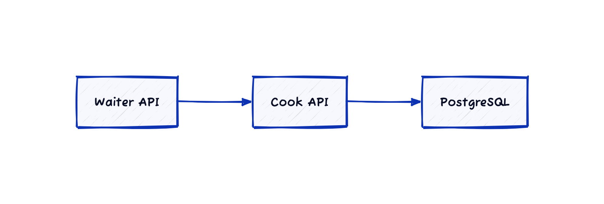
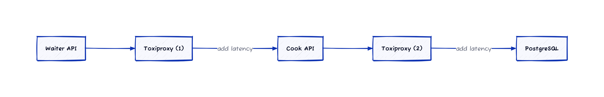

# Live profiling with Grafana Pyroscope
## Overview

This repository provides several services to demonstrate the features
of the [Grafana Pyroscope](https://grafana.com/oss/pyroscope/) live profiling
service.

### Demo applications
- The [cook](./services/cook/README.md) service, written in Go, that:
    - interacts with a PostgreSQL database to retrieve restaurant data: menu, dishes, ingredients
    - serves this data over an HTTP API
- The [waiter](./services/waiter/README.md) service, written in Python, that:
    - exposes an HTTP API to query data for a given restaurant
    - relays HTTP requests to the [cook](./services/cook/README.md) service

### Storage
- A [PostgreSQL 15](https://www.postgresql.org/docs/15/index.html) database to store and retrieve data
- A [Redis](https://redis.io/) key-value store to cache request responses

### Load testing
- [Locust](https://locust.io/) scenarii to run load testing sessions on the [cook](./services/cook/README.md)
  and [waiter](./services/waiter/README.md) services
- [Toxiproxy](https://github.com/Shopify/toxiproxy) network proxy to simulate network latency/jitter
  between the `cook` and `postgres` services

### Observability
- [Prometheus](https://prometheus.io/) times-series database to store application metrics
- [Pyroscope](https://grafana.com/oss/pyroscope/) to store and explore live profiling data
- [Grafana](https://grafana.com/oss/) to explore live profiling data stored by Pyroscope


## TL;DR - Service Addresses

| Service       | Address               | Role                                        |
|---------------|-----------------------|---------------------------------------------|
| Cook API      | http://localhost:8080 | Go HTTP API backed by a PostgreSQL database |
| Cook Locust   | http://localhost:8090 | Load tests for the Cook API                 |
| Waiter API    | http://localhost:8081 | Python HTTP API backed by the Cook HTTP API |
| Waiter Locust | http://localhost:8089 | Load tests for the Waiter API               |
| Grafana       | http://localhost:3000 | Visualization & dashboards                  |
| PostgreSQL    | localhost:5432        | Relational database for restaurant data     |
| Prometheus    | http://localhost:9090 | Time-series database                        |
| Redis         | localhost:6379        | Key-value store for API caches              |
| Pyroscope     | http://localhost:4040 | Live profiling                              |
| Toxiproxy API | http://localhost:8474 | Simulate network latency/jitter             |


## Demo
### Overview
#### Services


#### Demo stack



### Preparation
1. [Prepare the dataset for the demo](./dataset/README.md)
2. [Build the `cook` application and populate the database](./services/cook/README.md)

### Run services with Docker
Pull the Docker images for the service containers:

```shell
$ docker compose pull
```

Build the application containers:

```shell
$ docker compose build cook waiter
```

Start the Docker services:

```shell
$ docker compose up -d
```

### Run load test scenarii with Locust
Create and activate a Python virtualenv for Locust:

```shell
$ python3 -m venv .venv
$ source .venv/bin/activate
$ pip install -r loadtest/requirements.txt
```

Example - Run load tests on the `waiter` service's `v1` API:

```shell
$ make locust-waiter-v1
```
