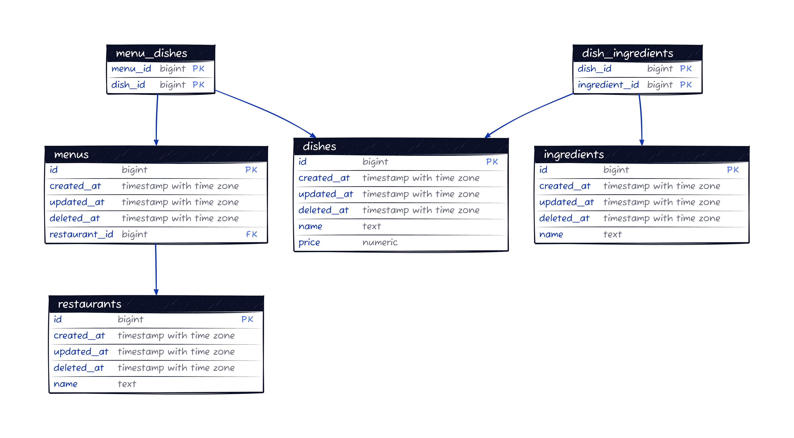

# Cook Service
## Build the application
```shell
$ make build
```

## Database

Start the PostgreSQL service:

```shell
$ docker compose up -d postgres
```

Apply database migrations:

```shell
$ ./build/cook migrate
```

Follow the instructions to [prepare the dataset for the demo](../../dataset/README.md).

Import recipes and ingredients to PostgreSQL:

```shell
$ ./build/cook import-recipes --input ../../dataset/recipes.out.json
```

Generate 100 restaurants and their respective menus:

```shell
$ ./build/cook create-restaurants --number 100
```

Inspect PostgreSQL data:

```shell
$ make psql
```

Dump the `restaurant` database:

```shell
$ make pgdump
```

## Reference
### Database Entity Relation Diagram

